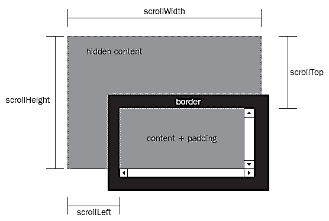

# JS获取浏览器中的元素位置

## 网页和窗口的区别

**网页** : 由内容和css样式表的总和；

**窗口** :

### 获取网页大小——clientHeight

- 网页的**每个元素**都有`clientHeight`和`clientWidth`属性。**只读** 

  `clientHeight`和`clientWidth`定义如下图：`content+padding`,**不** 含有`border+scrollbar`

   

- **document元素**的 `clientHeight`和`clientWidth`属性，就代表了网页的大小。

- 下面是获得 **浏览器窗口宽高**   的函数：

  ```javascript
  　function getViewport(){
  　　　　if (document.compatMode == "BackCompat"){ //向后兼容模式，即混杂模式
        //IE6的quirks模式中，document.body.clientWidth返回正确的值
  　　　　　　return {
  　　　　　　　　width: document.body.clientWidth, //在标准模式中，是网页的宽高
  　　　　　　　　height: document.body.clientHeight
  　　　　　　}
  　　　　} else {									//标准模式 ：CSS1Compat
        		return {
  　　　　　　　　width: document.documentElement.clientWidth, 
  　　　　　　　　height: document.documentElement.clientHeight
  　　　　　　}
  　　　　}
  　　}
  ```

  **注意** ：1.document生成后才可以起作用，所以加载完才执行该函数；

  ​		2.两个属性为只读的属性；

  ​

  ### 获取网页大小——scrollHeight

  - 网页上的每个元素有`scrollHeight和scrollWidth`属性,包含滚动条在内的视觉面积；

  - **document对象** 的`scrollHeight和scrollWidth`属性就是网页的大小(滚动条滚过的所有长度和宽度)

  - 下面是**获得网页宽高** 的函数

    ```javascript
    function getPagearea(){
    　　　　if (document.compatMode == "BackCompat"){
    　　　　　　return {
            //不同浏览器有不同的处理，这两个值未必相等,去较大的值
    　　　　　　　　width: Math.max(document.body.scrollWidth,//滚动条的宽高
    　　　　　　　　　　　　　　　　document.body.clientWidth),
    　　　　　　　　height: Math.max(document.body.scrollHeight,
    　　　　　　　　　　　　　　　　document.body.clientHeight)
    　　　　　　}
    　　　　} else {
    　　　　　　return {
    　　　　　　　　width: Math.max(document.documentElement.scrollWidth,
    　　　　　　　　　　　　　　　　document.documentElement.clientWidth),
    　　　　　　　　height: Math.max(document.documentElement.scrollHeight,
    　　　　　　　　　　　　　　　　document.documentElement.clientHeight)
    　　　　　　}
    　　　　}
    　　}
    ```

  ​

  ###  获取网页元素的绝对位置——offsetTop

  - 每个元素都有`offsetTop和offsetLeft`属性，表示该元素的**左上角**与**父** 容器（offsetParent对象）左上角的距离,`border`到左上角的距离，有4个属性；（这里是对整张网页的左上角）

     

    ```javascript
    　function getElementLeft(element){		//叠加计算
    　　　　var actualLeft = element.offsetLeft;//左边偏离
    　　　　var current = element.offsetParent;
    　　　　while (current !== null){ //有父元素
    　　　　　　actualLeft += current.offsetLeft;
    　　　　　　current = current.offsetParent;
    　　　　}
    　　　　return actualLeft;
    　　}
    　　function getElementTop(element){
    　　　　var actualTop = element.offsetTop;
    　　　　var current = element.offsetParent;
    　　　　while (current !== null){
    　　　　　　actualTop += current.offsetTop;
    　　　　　　current = current.offsetParent;
    　　　　}
    　　　　return actualTop;
    　　}
    ```

  **注意** ：对表格和iframe不适用；


###  **获取网页元素的相对位置**——offsetTop-scrollTop

- 该元素左上角相对于 **浏览器窗口左上角**的坐标

- 注意`scrollHeight和scrollTop`的区别！！！！

- 

  ```javascript
  function getElementViewLeft(element){
  　　　　var actualLeft = element.offsetLeft;
  　　　　var current = element.offsetParent;
  　　　　while (current !== null){
  　　　　　　actualLeft += current.offsetLeft;
  　　　　　　current = current.offsetParent;
  　　　　}
  　　　　if (document.compatMode == "BackCompat"){
  　　　　　　var elementScrollLeft=document.body.scrollLeft;
  　　　　} else {
  　　　　　　var elementScrollLeft=document.documentElement.scrollLeft; 
  　　　　}
  　　　　return actualLeft-elementScrollLeft; //绝对定位减去滚动条滚过的距离
  　　}
  　　function getElementViewTop(element){
  　　　　var actualTop = element.offsetTop;
  　　　　var current = element.offsetParent;
  　　　　while (current !== null){
  　　　　　　actualTop += current. offsetTop;
  　　　　　　current = current.offsetParent;
  　　　　}
  　　　　 if (document.compatMode == "BackCompat"){
  　　　　　　var elementScrollTop=document.body.scrollTop;
  　　　　} else {
  　　　　　　var elementScrollTop=document.documentElement.scrollTop; 
  　　　　}
  　　　　return actualTop-elementScrollTop;
  　　}
  ```


###  重要：获取元素位置的快速方法—getBoundingClientRect()

- `getBoundingClientRect()`，返回一个对象，其中包含了left、right、top、bottom四个属性，分别对应了该元素的左上角和右下角相对于**浏览器窗口** （viewport）左上角的距离

- 获得绝对定位的方法：

  ```javascript
  // this指jquery对象
    var X= this.getBoundingClientRect().left + document.documentElement.scrollLeft;

    var Y =this.getBoundingClientRect().top + document.documentElement.scrollTop;
    
    var y = $(this)[0].getBoundingClientRect().top
  ```

[参考阮一峰](http://www.ruanyifeng.com/blog/2009/09/find_element_s_position_using_javascript.html)
  ​
[看到的inview插件](https://github.com/protonet/jquery.inview)

